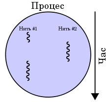
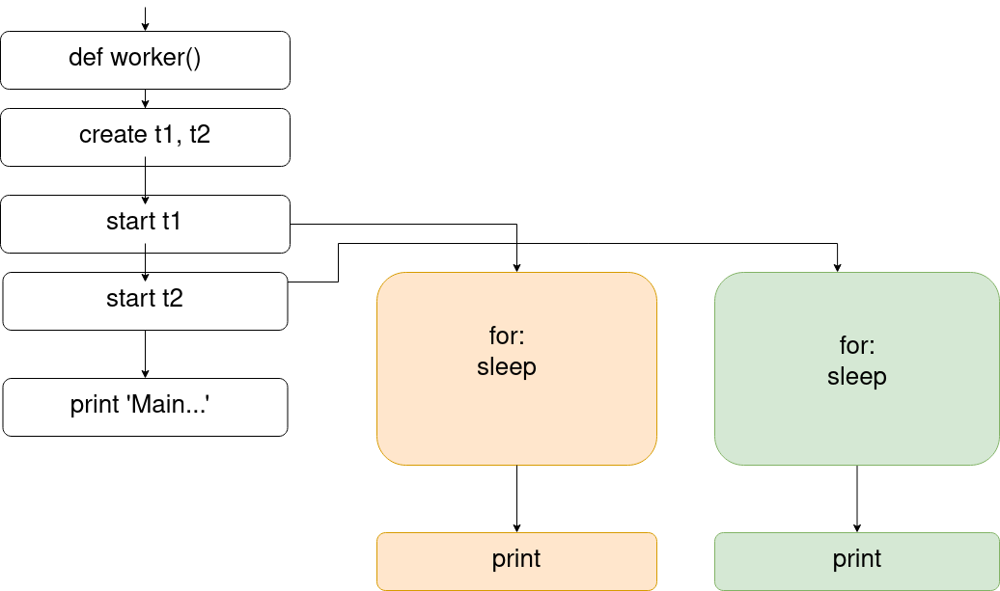

# Потоки, Мультипроцесорність

Згідно [Wikipedia](https://uk.wikipedia.org/wiki/%D0%9F%D0%BE%D1%82%D1%96%D0%BA_(%D1%96%D0%BD%D1%84%D0%BE%D1%80%D0%BC%D0%B0%D1%82%D0%B8%D0%BA%D0%B0)),
> Потік (англ. thread) або повніше потік виконання (англ. thread of execution), часто застосовуються назви нитка, нитка виконання та англіцизм тред — в інформатиці так називається спосіб програми розділити себе на дві чи більше паралельні задачі. Реалізація потоків та процесів відрізняються в різних операційних системах, але загалом потік міститься всередині процесу і різні потоки одного процесу спільно розподіляють деякі ресурси, у той час як різні процеси ресурси не розподіляють.



**Нитка** є «найлегшим» об'єктом для планувальника ядра. Щонайменше одна нитка існує всередині кожного процесу. Якщо в процесі співіснують багато ниток, вони розподіляють одну пам'ять і файлові ресурси. Нитки не мають своїх власних ресурсів, за винятком стеку, копії регістрів включно з лічильником задач.

**Процес** є «найважчим» об'єктом для планувальника ядра операційної системи. Власні ресурси процесу розміщені операційною системою. Ресурси включають пам'ять, відкриті файли та пристрої, сокети та вікна. Процеси не розділяють з кимось адресний простір чи залучені файли.

Також слід визначитись із такими термінами як **синхронність** та **асинхронність**.
У **синхронних** операціях задачі виконуються послідовно, одна за одною.
В **асинхронних**  - задачі можуть запускатись та завершуватись незалежно одна від одної.
Асинхронні задачі не не блокують операції і зазвичай виконуються у фоновому режимі.

У Python для роботи з нитками(тредами) використовується бібліотека "threading".
Це стандартна бібліотека і не потребує встановлення.
Синтаксис надзвичайно простий:

```python
class threading.Thread(group=None, target=None, name=None, args=(), kwargs={}, *, daemon=None)
```

Тобто, найпростіший тред можна створити командою:

```python
my_thread = threading.Thread(target=foo, args=(n,))
```

У цій команді ```foo``` - це функція, яку виконуватиме тред, ```args``` - це аргументи, які передадуться функції.

**Зверніть увагу:** вказується лише ім'я функції, без дужок. В якості аргументів має передаватись лише ітерабельний об'єкт (список, кортеж).

Тому для функції

```python
def my_exponentiation(number):
    rezult = number ** 2
    print(rezult)
```

створення потоку виглядатиме наступним чином:

```python
number = 4
my_thread = threading.Thread(target=my_exponentiation, args=(number,))
```

Описаним вище способом ми створили екземпляр класу ```Thread```.
Тепер наш потік потрібно запустити для виконання. Це здійснюється за допомогою методу ```start()```.
У нашому прикладі це виглядатиме як ```my_thread.start()```.

Зазначеного коду достатньо, щоб створити та запустити потік (якщо не забути про ```inport threading```.)

Але радіти такій простоті рано, так як найбільша складність у роботі з потоками полягає у відстежуванні послідовності їх роботи.
Слід постійно пам'ятати, що створені нами треди, це такі самі потоки, як і основний потік програми і кожен окремий тред може мати свій час виконання.

Це добре видно з наступного прикладу:

```python
# threading1
import threading
import time


def worker(number):
    thread_name = threading.current_thread().name
    for i in range(1000):
        number = i
        time.sleep(0.001)
    print(f"I am Worker {thread_name}, my number is {number}\n")


number = 0
t1 = threading.Thread(target=worker, name='t1', args=(number,))
t2 = threading.Thread(target=worker, name='t2', args=(number,))

t1.start()
t2.start()

print('Main thread is finished', '\n')

```

Результат має бути очевидним: після старту двох тредів, основному потоку залишається лише виконати останній ```print``` незалежно від результатів та часу роботи запущених тредів.

Тому і отримаємо:

```bash
Main thread is finished

I am Worker t2, my number is 999

I am Worker t1, my number is 999
```

Зверніть увагу, що тред №2 закінчив роботу раніше, ніж тред №1, хоча запущений був пізніше.
Цікаво також, що так трапляється не завжди. Інколи №1 фінішує першим, але через особливості коду, користувацькі потоки ніколи не обженуть основний потік.

Це можна продемонструвати діаграмою:



Щоб уникнути такої поведінки, використовується метод ```join()```, який приєднує тред до основного потоку. Як наслідок - основний потік продовжить свою роботу лише після того, як дочекається завершення приєднаного потоку.

У зв'язку з цим слід згадати і параметр треда ```daemon=```. Якщо йому передати значення ```True```, то потік після старту стане "демоном" - працюватиме взагалі без зв'язку з основним потоком і незалежно від його завершення.
Тобто без цього параметру наша програма все ж чекає завершення усіх потоків, і лише тоді завершується. Адже, не зважаючи на те, що у нашому прикладі основний потік виконав свою останню стрічку коду, ми все ж отримали результати виконання потоків 1 та 2 і лише після цього програма завершилась. Якщо ж якийсь із цих потоків буде демоном, то програма завершиться, не очікуючи на нього.

У цьому розділі ми побачили різницю між **синхронністю** (звичайний покроковий код) та **асинхронністю** (код з використанням потоків).

Також розрізняють **конкурентність** та **паралелелізм**.
Конкурентність означає, що задачі виконуються сумісно.
Паралелелізм є формою конкурентності, але можливість його застосування залежить від обладнання. Наприклад, якщо у процесора лише одне ядро, задачі паралельно виконуватись не можуть.

У наведених вище прикладах нам вдалось створити асинхронний код, але він не був паралельним. Це пов'язано з існуванням GIL (Global Interpreter Lock).
Саме GIL стежить, щоб інтерпретатор Python запускав один і лише один потік за раз, тобто, щоб потоки не виконувались паралельно.

З одного боку це означає, що на звичайних операціях асинхронний код втрачає будь-який сенс. Адже насправді, потоки виконуються не паралельно. Перехід від одного потоку до іншого відбувається лише якщо попередній потік завершив свою роботу, або припинив з якихось  причин використовувати процесор.

Це можна перевірити експериментально. Створимо просту програму, яка виконуватиме ідентичні дії з використанням потоків і без них:

```python
import threading


def counter(number):
    for i in range(number):
        x = i
    print(x)


def threads_task(number):
    number = int(number / 2)
    t1 = threading.Thread(target=counter, args=(number,))
    t2 = threading.Thread(target=counter, args=(number,))

    # start threads
    t1.start()
    t2.start()

    # wait until threads finish their job
    t1.join()
    t2.join()


def single_task(number):
    counter(number)


number = 10_000_000
# threads_task(number)
single_task(number)
```

Заміри часу виконання показують, що у більшості випадків синхронний код навіть трохи швидший від асинхронного.

Тому повторю ще раз: у кожен окремий момент часу лише один потік може використовувати пам'ять та процесор (у межах даного процесу).

У цьому зв'язку необхідно звернути увагу ще на одну особливість застосування тредів: не кожну функцію можна передавати під управління потоку. Якщо ви звернули увагу, у всіх прикладах з тредами використвуються функції без ключового слова ```return```. Тобто, звичним способом ви не зможете отримати результат роботи функції.
    Варіантів обійти це обмеження декілька:

1. ```global``` - можна примусити функцію, яка запущена у треді змінювати глобальну змінну. Але у такому випадку потрібно стежити, щоб у період роботи треду ця змінна більш ніким не використовувалась.

2. ```lock``` - функція блокування, яка входить до складу threading. При її використанні необхідно спочатку створити окремий екземпляр класу lock - наприклад ```lock = threading.lock()```. У подальшому у кожному випадку використання тредом глобальної змінної, її слід спочатку блокувати(резервувати) а потім відпускати (дозволяти використання іншими):

    ```python
    def foo():
        global x
        lock.acquire()
        # do something on x
        lock.release()
    lock = threading.lock()
    ```

3. ```yield``` - функція повертатиме значення на кожному її виклику. Але у такому разі виклики функції, які мають відбуватись також у циклі прийдеться також поміщати у окремі потоки.

4. ```local``` - існує об'єкт - сховище, у якому кожен тред зберігатиме свою інформацію окремо. Найкраще видно з прикладу:

    ```python
    import threading
    class Worker(threading.Thread):
        ns = threading.local()
        def run(self):
            self.ns.val = 0
            for i in range(5):
                self.ns.val += 1
                print("Thread:", self.name, "value:", self.ns.val)
    w1 = Worker()
    w2 = Worker()
    w1.start()
    w2.start()
    w1.join()
    w2.join()
    ```

    Результатом буде:

    ```python
    Thread: Thread-1 value: 1
    Thread: Thread-2 value: 1
    Thread: Thread-1 value: 2
    Thread: Thread-2 value: 2
    Thread: Thread-1 value: 3
    Thread: Thread-2 value: 3
    Thread: Thread-1 value: 4
    Thread: Thread-2 value: 4
    Thread: Thread-1 value: 5
    Thread: Thread-2 value: 5
    ```

    Більше прикладів використання ```local``` можна знайти на [stackoverflow](https://stackoverflow.com/questions/1408171/thread-local-storage-in-python).

У той же час GIL не керує операціями вводу і виведення. Тому саме до цих операцій корисно застосовувати розподіл на треди.

Як бачите, використання базового модуля ```threading``` доволі нерпоста задача. Тому існують більш високорівневі бібліотеки, які дозволяють робити те ж саме без зайвого клопоту.

Як приклад: ```ThreadPoolExecutor``` з модуля ```concurrent.futures```.

```python
from concurrent.futures import ThreadPoolExecutor
from time import sleep
def task(message):
   sleep(2)
   return message

def main():
   executor = ThreadPoolExecutor(5)
   future = executor.submit(task, ("Completed"))
   print(future.done())
   sleep(2)
   print(future.done())
   print(future.result())
if __name__ == '__main__':
main()
```

У наведеному вище прикладі ThreadPoolExecutor був побудований з 5 потоків.

Ще один спосіб створити екземпляр ThreadPoolExecutor - за допомогою контекстного менеджера. Це працює аналогічно методу, який використовується у наведеному вище прикладі. Основна перевага використання контекстного менеджера полягає в тому, що він виглядає синтаксично добре. Екземпляр можна зробити за допомогою наступного коду -

```python
with ThreadPoolExecutor(max_workers = 5) as executor
```

Частіше використовується метод map(), який отримує функцію та список аргументів, та повертає список результатів роботи функції у різних потоках:

```python
from concurrent.futures import ThreadPoolExecutor
from concurrent.futures import as_completed
values = [2,3,4,5]
def square(n):
   return n * n
def main():
   with ThreadPoolExecutor(max_workers = 3) as executor:
      results = executor.map(square, values)
for result in results:
      print(result)
if __name__ == '__main__':
   main()
```

результатом буде:

```python
4
9
16
25
```
